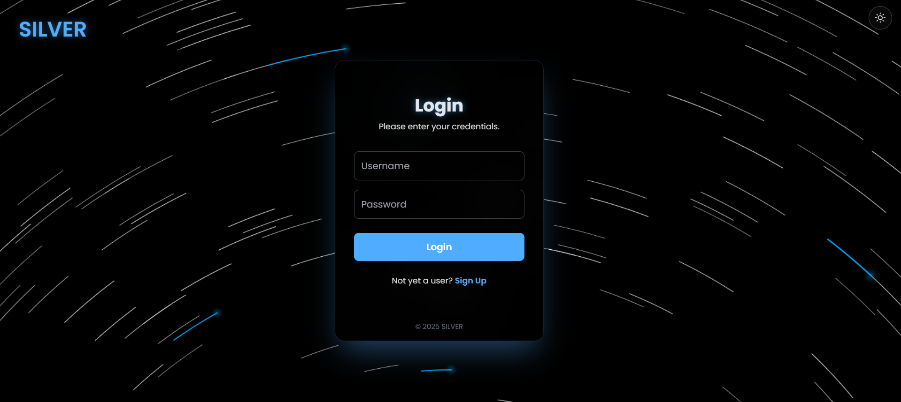
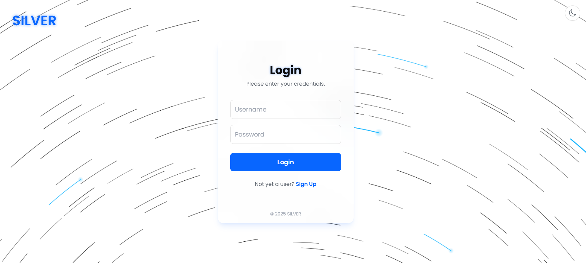
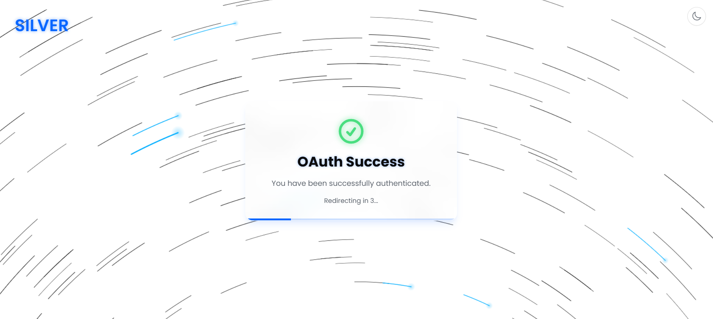
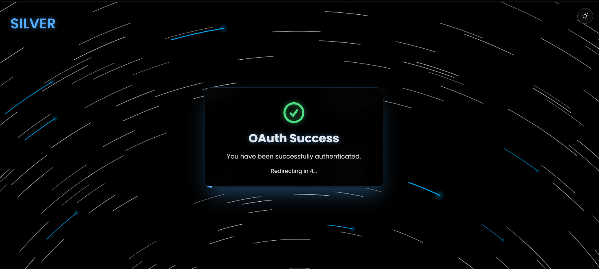

# SILVER OAUTH


A modern, animated authentication page with a dynamic star trail background and light/dark theme support. Designed for a premium user experience, this project serves as a sleek, reusable front-end for any application requiring user login and registration.

---

## ✨ Key Features

- **Dynamic Animated Background**  
    
  A captivating star trail animation that adds a futuristic and premium feel.

- **Light & Dark Mode**  
    
  A smooth, persistent theme switcher that respects user preference.

- **Modern UI/UX**  
    
  Clean, minimalist design with fluid animations and transitions.

- **Session Persistence**  
  Remembers logged-in users for a seamless "Welcome Back" experience.

- **Responsive Design**  
    
  Fully responsive layout that looks great on all screen sizes, from mobile to desktop.

- **Component-Based Architecture**  
  Built with React, making it easy to understand, customize, and extend.

---

## 🛠️ Tech Stack

- **Framework**: [React](https://reactjs.org/)
- **Build Tool**: [Vite](https://vitejs.dev/)
- **Language**: [TypeScript](https://www.typescriptlang.org/)
- **Styling**: [Tailwind CSS](https://tailwindcss.com/) (via CDN)
- **AI Integration**: [Google Gemini AI](https://ai.google.dev/)
- **Fonts**: [Google Fonts](https://fonts.google.com/) (Poppins & Orbitron)

---

## 🚀 Getting Started

Follow these instructions to get a copy of the project up and running on your local machine for development and testing purposes.

### Prerequisites

- [Node.js](https://nodejs.org/en/) (v18 or later recommended)
- [npm](https://www.npmjs.com/) (comes with Node.js)

### Installation & Setup

1. **Clone the repository:**
    ```bash
    git clone https://github.com/SilverShadowHeart/HWI_SILVER.git
    cd silver-authentication
    ```

2. **Install dependencies:**
    ```bash
    npm install
    ```

3. **Set up environment variables:**

    - Create a new file named `.env.local` in the root of the project.
    - Add your Gemini API key to this file:
      ```
      GEMINI_API_KEY="YOUR_API_KEY"
      ```
    > Get your API key from [Google AI Studio](https://aistudio.google.com/app/apikey).

4. **Run the development server:**
    ```bash
    npm run dev
    ```

Your app should now be running at `http://localhost:5173`.

---

## 📜 Available Scripts

| Command           | Description                                       |
|------------------|---------------------------------------------------|
| `npm run dev`    | Start development server with HMR                 |
| `npm run build`  | Bundle the app into static files for production   |
| `npm run preview`| Preview the production build locally              |

---

## 📂 Project Structure
```
/
├── public/ # Static assets
├── src/
│ ├── components/ # Reusable React components (AuthForm, StarCanvas, etc.)
│ ├── hooks/ # Custom React hooks (e.g., useTheme)
│ ├── App.tsx # Main application component and logic
│ ├── index.tsx # React entry point
│ └── index.css # Global styles
├── .env.local # Environment variables (you need to create this)
├── index.html
├── demo-screenshots/ # 1.png, 2.png, 3.png, 4.png, 5.png
├── package.json # Project dependencies and scripts
└── README.md # You are here!

```

---

## 🖼️ UI Preview Gallery

| Login animation(dark) | | Login View(light) | Login View(dark)  | OAuth Success (light) | | OAuth Success (dark) |
|------------|----------------|-------------|---------------------|---------------------|---------------------|
|  |  |  |

---

## 📄 License

This project is open-source and available under the [MIT License](LICENSE).
